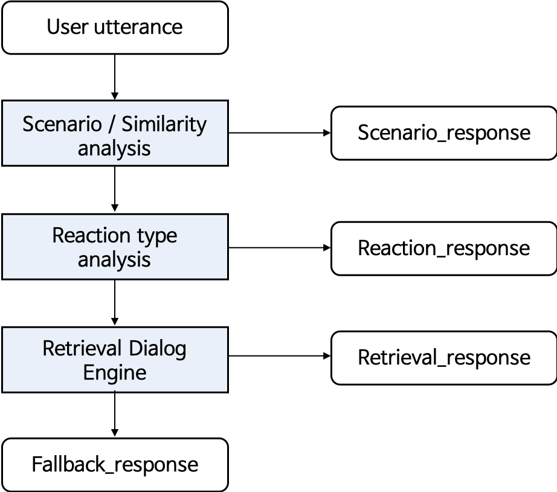
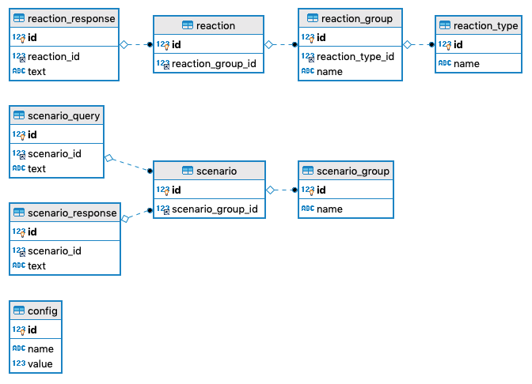

# Tikitaka
Project for data driven open domain dialog model serving web application

## Main features
    1. Respond proper response(reponse generation or retrieval)

    2. Respond proper response after classifying specific user intention or action

For supporting these functions, Tikitaka provides easy data register & modifying, incremental model learning & deploy

## Model work flow

## Database ERD

---