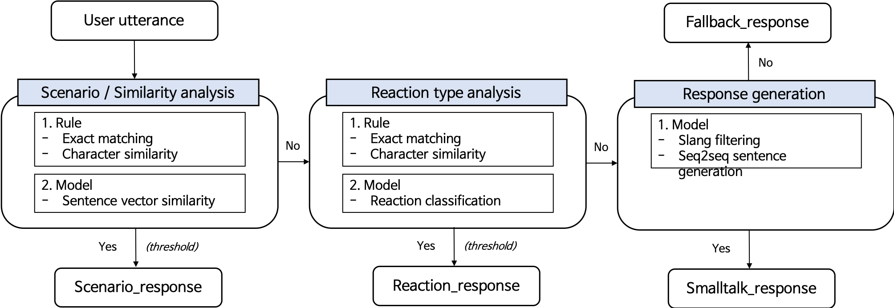
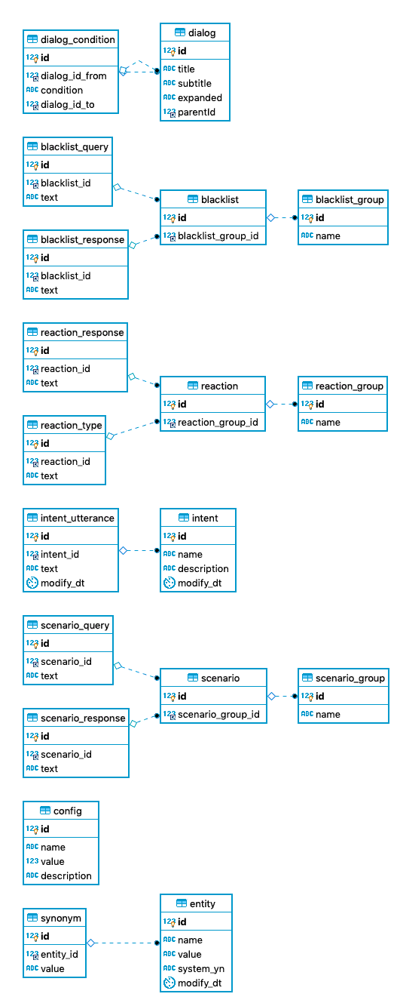

# Tikitaka
Project for data driven open domain dialog model serving web application

## Main features
    1. Respond proper response(reponse generation or retrieval)

    2. Respond proper response after classifying specific user intention or action

For supporting these functions, Tikitaka provides easy data register & modifying, incremental model learning & deploy

## Model work flow

## Database ERD

---

## Berg report
##### 1. 대그룹 순서사 섞이는 경우 발생
##### 2. 특정 query (ex, 최애 컬러가 뭐야?) 같은 경우 다른 소그룹의 query에 등장 (DB, API에는 문제 없음)
##### 2번의 경우 대그룹 태그를 클릭하면 발생하는 것으로 보임. 자동 답변 갔다오면 괜찮아짐.